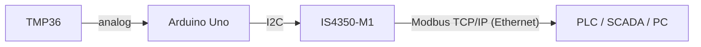

# IS4350-M1 Arduino Temperature Sensor

A Modbus TCP/IP temperature sensor built with an Arduino Uno, a TMP36 and the INACKS **IS4350-M1** module.

The IS4350-M1 puts the IS4350 Modbus TCP/IP server IC, a LAN8742A Ethernet PHY, the Ethernet magnetics and an RJ45 connector on a single module. Your Arduino talks to it over I2C, as if it were an I2C memory, and the module takes care of Ethernet, TCP/IP and Modbus. This example reads a TMP36 and publishes the temperature in a Holding Register that any Modbus TCP/IP client (PLC, SCADA, HMI or PC) can read.

No Ethernet or Modbus library is needed, only the standard `Wire` library.



## Features

- Reads a TMP36 on `A0` once per second
- Publishes the temperature in Holding Register 0 (`HOLD_0`) as a signed 16-bit value in 0.1 °C
- Gets its IP address by DHCP and prints it on the Serial Monitor
- Writes a valid reading before the Modbus server goes online, so a client never reads uninitialized data
- Checks that the module answers before doing anything else

## Hardware

| Qty | Part |
|:---:|---|
| 1 | Arduino Uno |
| 1 | IS4350-M1 module |
| 1 | TMP36 temperature sensor |
| 2 | 4.7 kΩ resistors (I2C pull-ups) |
| 1 | 3.3 V regulator to power the module |
| 1 | Ethernet cable and a network with a DHCP server |

Other Arduino boards work too, as long as their I2C supports clock stretching, which the IS4350 uses. Connect the module to the board's SDA and SCL pins.

## Wiring

### TMP36

| TMP36 | Arduino Uno |
|---|---|
| +Vs | 5V |
| Vout | A0 |
| GND | GND |

With the flat side facing you and the legs down, the pins are +Vs, Vout and GND from left to right.

### IS4350-M1

| IS4350-M1 pin | Connect to | Notes |
|---|---|---|
| 3V3 (7, 35) | 3.3 V regulator output | Do not use the Uno 3.3V pin (50 mA max) |
| GND | Arduino GND and regulator GND | Common ground |
| SDA (2) | A4 | 4.7 kΩ pull-up to 5 V |
| SCL (1) | A5 | 4.7 kΩ pull-up to 5 V |
| SPD (3) | GND | I2C at 100 kHz |
| ADR (4) | GND | I2C address 24 |
| RJ45 | Switch or router | The network needs a DHCP server |
| All other pins | — | Leave floating |

> [!NOTE]
> The IS4350 alone can draw up to 90 mA, plus the Ethernet PHY, so the module needs its own 3.3 V regulator (for example, an LDO fed from the Uno's 5V pin). SDA and SCL are 5 V tolerant, so the pull-ups go to the Uno's 5 V. SPD and ADR are read only at power-up and must never be left floating.

## Getting started

1. Clone this repository. The Arduino IDE needs the sketch inside a folder with the same name:

```
   .
   ├── README.md
   └── IS4350_M1_Temperature_Sensor/
       └── IS4350_M1_Temperature_Sensor.ino
```

2. Open `IS4350_M1_Temperature_Sensor.ino` in the Arduino IDE, select **Arduino Uno** and its port, and click **Upload**.

   Or with `arduino-cli` (replace `/dev/ttyACM0` with your port):

```bash
   arduino-cli core install arduino:avr
   arduino-cli compile --fqbn arduino:avr:uno IS4350_M1_Temperature_Sensor
   arduino-cli upload -p /dev/ttyACM0 --fqbn arduino:avr:uno IS4350_M1_Temperature_Sensor
```

3. Open the Serial Monitor at **9600 baud**. Once the server is online, the sketch prints the IP address and then the temperature every second:

```
   Status: 2
   Status: 3
   Status: 4
   Sensor online. IP: 192.168.1.57, port 502
   Temperature: 24.7 C
   Temperature: 24.8 C
```

4. Connect any Modbus TCP/IP client to that IP address and read the temperature.

## Reading the temperature

| Setting | Value |
|---|---|
| IP address | Printed on the Serial Monitor |
| Port | 502 |
| Unit ID | 255 |
| Function code | 03 (Read Holding Registers) |
| Address | 0 (`HOLD_0`), shown as 40001 in tools that number registers from 1 |
| Quantity | 1 |
| Data type | INT16 (signed) |
| Scale | 0.1 °C |

| HOLD_0 | Temperature |
|---:|---:|
| 235 | 23.5 °C |
| 0 | 0.0 °C |
| -52 | -5.2 °C |

If your client shows unsigned values, negative temperatures appear above 32767: -52 is shown as 65484 (0xFFCC).

A list of recommended Modbus client applications is on the [IS4350 product page](https://www.inacks.com/is4350).

## How it works

The IS4350 memory map has 16-bit registers with 16-bit addresses. The sketch only uses these:

| Register | Address | Use |
|---|---|---|
| `HOLD_0` | 0 | Temperature, written by the Arduino and read by the Modbus client |
| `IP` | 65501–65504 | IP address assigned by DHCP, one byte per register |
| `GO_ONLINE` | 65513 | Write 1 to start the Modbus server |
| `STATUS` | 65514 | Low byte = 5 when the server is ready and listening |
| `CHIP_ID` | 65522 | Always 150, used to check the I2C link |

At start-up the sketch:

1. Reads `CHIP_ID` to check that the module answers.
2. Writes the first reading to `HOLD_0`.
3. Writes 1 to `GO_ONLINE`. The server never starts on its own (fail-safe power-up).
4. Polls `STATUS` until its low byte is 5.
5. Reads the `IP` registers and prints the address.

Then `loop()` writes a new reading to `HOLD_0` every second.

Every register access is a plain I2C transfer, with the address and the data sent most significant byte first:

```
Write:  START | ADDR+W | REG_H | REG_L | DATA_H | DATA_L | STOP
Read:   START | ADDR+W | REG_H | REG_L | RESTART | ADDR+R | DATA_H | DATA_L | STOP
```

`ADDR` is the 7-bit address 24 (0x18). The helper functions wait 5 ms after each transfer, because the IS4350 needs a few milliseconds between I2C operations.

## Customizing

- **Another sensor:** replace `readTemperature()` with your own code and keep writing the result to `HOLD_0`.
- **3.3 V boards:** set `ADC_REF_MV` to `3300` and pull SDA and SCL up to 3.3 V.
- **More values:** write them to `HOLD_1`, `HOLD_2` and so on. 65,500 Holding Registers are available.
- **Another I2C address or speed:** ADR selects address 24 (GND), 25 (1.65 V, two 10 kΩ resistors as a divider) or 26 (3.3 V). SPD selects 100 kHz (GND), 400 kHz (1.65 V) or 1 MHz (3.3 V). Update `IS4350_ADDR` and call `Wire.setClock()` to match.
- **Static IP:** stop the server (`GO_ONLINE` = 0), write 0 to the `DHCP` register (65500), then write the `IP`, `MASK` and `GATEWAY` registers. See the IS4350 datasheet for the details.

## Troubleshooting

| Symptom | What to check |
|---|---|
| `IS4350-M1 not detected` | Power, GND, SDA/SCL wiring and pull-ups. SPD and ADR must be tied, not floating. They are read at power-up, so power-cycle the module after changing them. |
| Status stays at 3 | No DHCP server answered. Connect the module to a router or switch with DHCP, or set a static IP. |
| Status 103 | The network cable is disconnected. Check the cable and the RJ45 LEDs. |
| Status 101 or 102 | Invalid MAC address configuration. Hold DEF (pin 5) high for 3 s to restore the defaults. |
| The client can't connect, although the status is 5 | Use the printed IP and port 502, and keep the client on the same subnet. Only one client can be connected at a time. |
| Wrong temperature | Check the TMP36 pinout and that `ADC_REF_MV` matches your board. |

## Documentation

- [IS4350-M1 product page](https://www.inacks.com/is4350-m1)
- [IS4350 product page](https://www.inacks.com/is4350)

The IS4350-M1 user manual (ISDOC155) covers the module pinout, power supply and integration. The IS4350 datasheet (ISDOC139) covers the full register map, the I2C protocol and the safety features.
